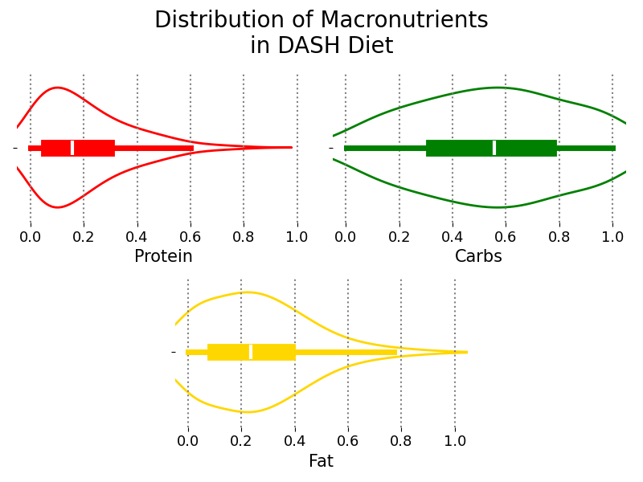
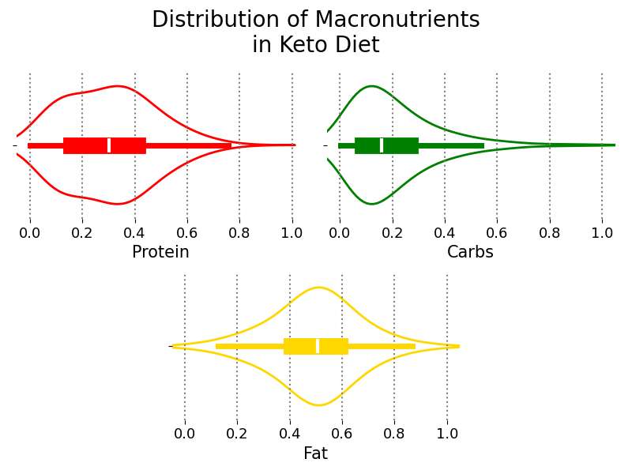
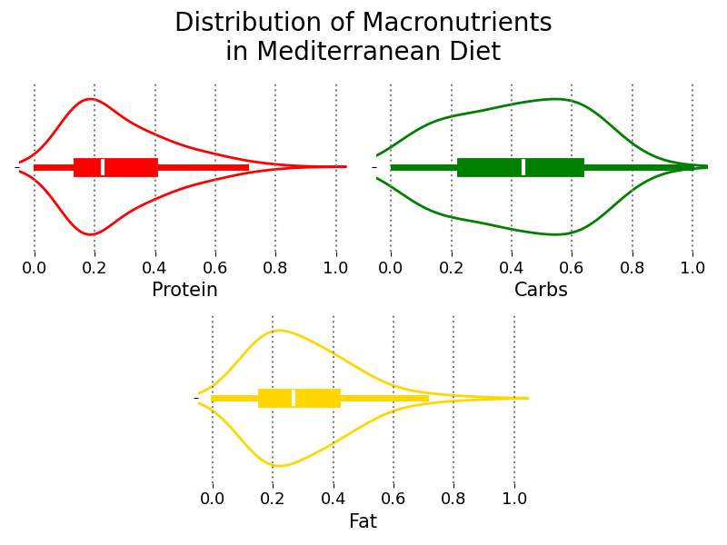
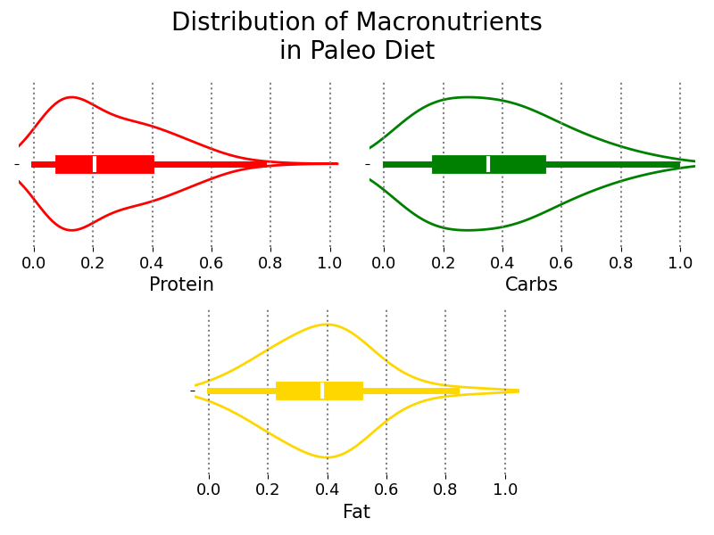
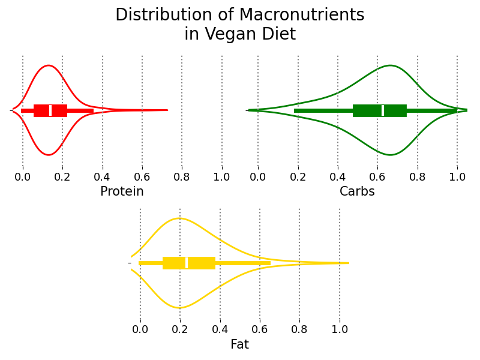

# Analysis Nutritional Information

## Abstract
Statistical analysis (Exploratory Data Analysis) of the nutritional values (macronutrients) of recipes of different types of diets in order to generate a statistical description of the diets.

## Author, Affiliation and Contact
Alexis Aguilar [Student of Bachelor's Degree in "Tecnologías para la Información en Ciencias" at Universidad Nacional Autónoma de México [UNAM](https://www.unam.mx/)]: alexis.uaguilaru@gmail.com

Project developed for the subject "Descriptive and Inferential Statistics" for the class taught in semester 2025-2.

## License
Project under [MIT License](LICENSE)

## Introduction
The purpose of this work is to present the process carried out to perform the statistical analysis of the nutritional values (macronutrients) provided by recipes of the following diets: DASH (Dietary Approaches to Stop Hypertension), keto, mediterranean, paleo and vegan. The main focus is to answer whether there is a significant nutritional difference between the different diets, or equivalently whether each diet follows its own trend or preferences of the foods that are consumed and prepared.

## General Aim
Making use of different techniques and tools of descriptive and inferential statistics to perform a statistical analysis of the macronutrients consumed in the different recipes with the objective of describing their macronutrient consumption patterns and trends according to the diet to which they belong, and testing whether there is a significant difference between the different patterns and trends reported in each diet based on the nutritional contributions (macronutrients).

## About the Dataset 
The dataset is taken from [[1]](#references). The dataset contains information on the nutritional values of carbohydrates, proteins and fats of recipes from different international cuisines and diets.

## Exploratory Data Analysis
In [ExploratoryDataAnalysis.py](./StatisticalAnalysis/ExploratoryDataAnalysis.py) the different ideas and comments related to the statistical analysis of the recipes based on the context of the diet to which they belong are presented. This generates a better interpretation of the observed statistics and how they are related based on the products and foods representative of each diet, which leads to a more consolidated knowledge about the trends and patterns that follow the diets presented in [[2]](#references), and which are statistically reinforced.

This last result contributes significantly to the [General Aim](#general-aim) of the project, that is, evidence is being generated to support the hypothesis that each diet distinguishes itself from others on the basis of nutritional contributions. This can be best observed by looking at the distribution of macronutrients in each diet.







## Installation and Usage
First it has to clone the repository and move to the project directory:
```bash
git clone https://github.com/alexisuaguilaru/Analysis_Nutritional_Information
cd Analysis_Nutritional_Information
```
Preferably using a virtual environment of Python, install the libraries required for the project with:
```bash
pip install -r requirements.txt
```
With this, one can run and view the Marimo notebooks with the following command:
```bash
marimo run StatisticalAnalysis/ExploratoryDataAnalysis.py
```

## Technologies
* [Python](https://www.python.org/)
  * [Marimo](https://marimo.io/)
  * [Pandas](https://pandas.pydata.org/)
  * [Seaborn](https://seaborn.pydata.org/)
  * [SciPy](https://scipy.org/)
  * [NumPy](https://numpy.org/)

## References
- [1] Diets, Recipes And Their Nutrients. Kaggle. https://www.kaggle.com/datasets/thedevastator/healthy-diet-recipes-a-comprehensive-dataset
- [2] F. F. Marvasti, "Popular Diets and Health", Culinary Medicine